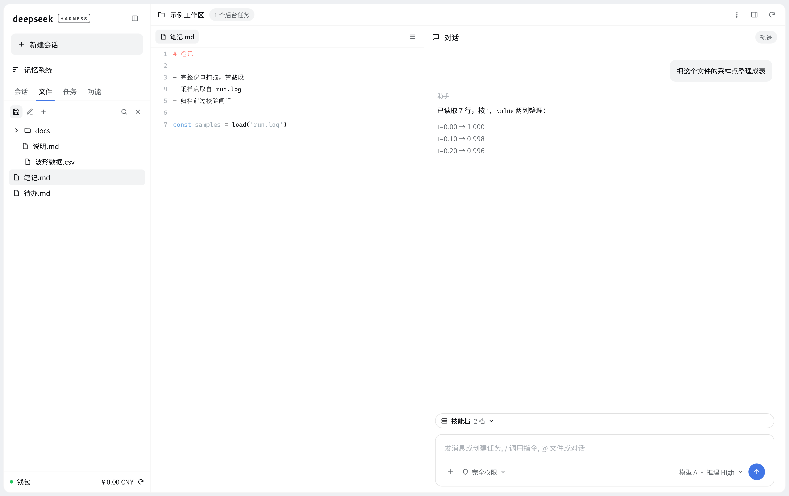

# dsh-vk-suite

[中文](README.md) · English




*Mockups: layout rendered from the official theme tokens, not screenshots of a running instance.*

A three-column layout for DSH. It takes all 8 packages to form: `dsh-vk-contract` is the contract, the other 7 each fill one pane and hook onto the contract through `dsh.client.inject`.

| Package | Role |
|---|---|
| `dsh-vk-contract` | Ecosystem contract: slot-name constants, the `vkCard` registration API, service names. No runtime behaviour |
| `dsh-vk-layout` | Skeleton: area hosts, tab strip, slot wiring and three neutral services |
| `dsh-vk-files` | Files column: file tree + in-app directory browser + recent files / file list |
| `dsh-vk-composer` | Composer: @-references to data sources + file-search button + jump from a chat path to the right column |
| `dsh-vk-viewer` | Right-column viewer: Office documents / web pages / images / text |
| `dsh-vk-settings` | Settings sections: global persona / skill management / MCP management |
| `dsh-vk-terminal` | Session-header restart entry: two-click confirm + backend probe reset |
| `dsh-vk-cmdstrip` | Command strip at the bottom of the right column (the official terminal itself) |

## Install

All eight packages are required; install the contract first:

```sh
dsh plugin --profile web add file:<this repo>/dsh-vk-contract
dsh plugin --profile web add file:<this repo>/dsh-vk-layout
dsh plugin --profile web add file:<this repo>/dsh-vk-files
dsh plugin --profile web add file:<this repo>/dsh-vk-composer
dsh plugin --profile web add file:<this repo>/dsh-vk-viewer
dsh plugin --profile web add file:<this repo>/dsh-vk-settings
dsh plugin --profile web add file:<this repo>/dsh-vk-terminal
dsh plugin --profile web add file:<this repo>/dsh-vk-cmdstrip
```

Restart the web instance afterwards.

## Configuration

| Item | Where | Default |
|---|---|---|
| Landing-page roots for the files column | `HOME_DIRS` in `dsh-vk-files/lib/client.js` | `[]` — add your own directories |
| Desktop shortcut entry | `DESKTOP_HINT` in the same file | `D:\Desktop` |

## Requirements

- Depends on the official UI packages (`@deepseek-ai/dsh-client-ui-*`), provided by the DSH runtime

## Slots reserved for other plugins

Rows with `provider: null` in the contract table are reserved slots: a third-party plugin claims one without touching the skeleton.

```js
const { VK, vkCard } = require('dsh-vk-contract');
vkCard(ctx, { slot: VK.statusbar.left, id: 'my-lan-link', order: 10, component: MyLanLink });
```

Your own package must declare `dsh.client.inject: ["dsh-vk-contract"]` in its package.json before `require` resolves the contract.

| Reserved slot | Intended for |
|---|---|
| `vk.statusbar.left` | LAN links: local LAN access URLs, local service lists |
| `vk.statusbar.right` | Public links: tunnels / reverse proxies / share URLs |
| `vk.rightbar.tools` | Third-party right-column tool page (a tab) |
| `vk.input.left` | Slot left of the composer |
| `vk.session.header.left` | Session-header left actions |
| `vk.overlay` | Full-screen overlay |
| `vk.settings.extra` | "Extensions" section in Settings (currently taken by dsh-skill-sets) |

Status bar and overlay need a host first: they exist once `dsh-vk-layout` is installed.
