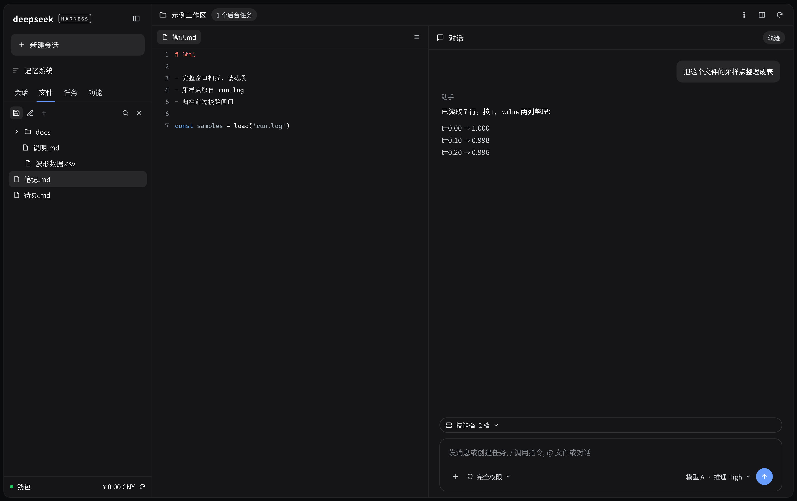

# dsh-vk-suite

[中文](README.md) · English



*Screenshot of a running DSH instance; demo content is sanitized.*

A framework repo with just two packages: contract + skeleton. The skeleton provides every three-column position — left-column tabs, right-column tabs and **the command panel in the right column's lower segment**; other feature plugins live in their own repos and register into slots.

| Package | Role |
|---|---|
| `dsh-vk-contract` | Ecosystem contract: slot-name constants, the `vkCard` registration API, service names. No runtime behaviour |
| `dsh-vk-layout` | Skeleton: the left-column tab host, the right-column tab host (including the command panel in its lower segment), slot wiring and three neutral services |

## Install

```sh
dsh plugin --profile web add file:<this repo>/dsh-vk-contract
dsh plugin --profile web add file:<this repo>/dsh-vk-layout
```

Restart the web instance afterwards. The skeleton only provides positions; what lands in them is up to the individual plugins.

## What the skeleton does

| Area | Official | What vk does |
|---|---|---|
| **Sidebar** | One single `sidebar.workspaces` browsing region, **no tabs**; plus `sidebar.panellist` (global panel icons) and `sidebar.footer.action` | Turns the browsing region into **four tabs**: Sessions (= official region), Files, Tasks, Extensions — the last three are `vk-new`; the footer seat is an official alias |
| **Center (conversation)** | `main`, `conversation.session.header.*`, `conversation.input.*` | Untouched — alias forwarding only; plugins may register in the official slots directly |
| **Right column** | `rightbar` + `sidebar.right.pane.tab` (keyed by id) | Viewer / Open-local-file are aliases of the official keyed slot; **the command panel in the lower segment ships with the skeleton** (the official terminal, own host node, no slot) |
| **Settings** | `settings.section` (one list entry = one page, custom id allowed) | All three sections are aliases of `settings.section(id=…)` |
| **Frame-wide** | `shell.overlay` | Overlay is an alias |

## Feature plugins, each in its own repo

| Repo | Contents |
|---|---|
| [dsh-files](https://github.com/Ln1m/dsh-side-files) | `dsh-files-tree`: the sidebar "Files" tab (file tree + in-app directory browser + recent files) plus the composer's `@` references; `dsh-files-open`: the right-column "Open local file" tab |
| [dsh-viewer](https://github.com/Ln1m/dsh-pane-viewer) | Right-column "Viewer": Office / web / image / text preview |
| [dsh-lt-tasks](https://github.com/Ln1m/dsh-side-tasks) | The sidebar "Tasks" tab |
| [dsh-tools](https://github.com/Ln1m/dsh-side-tools) | The sidebar "Extensions" tab (example) |
| [dsh-lan-services](https://github.com/Ln1m/dsh-card-lan-services) | The sidebar "Extensions" tab (LAN services) |
| [dsh-wallet](https://github.com/Ln1m/dsh-foot-wallet) / [dsh-archive-button](https://github.com/Ln1m/dsh-foot-archive) | The sidebar footer seat |

## How to use it / what it conflicts with

The four sidebar tabs (Sessions / Files / Tasks / Extensions) come from **this skeleton**; feature plugins only put content into slots:

- **Every feature plugin ships in two builds**: each repo's `main` is the **vk build** (vk slots only, this skeleton required), and an `official` branch holds the **vk-free build** (no vk dependency, official slots only). **Use the vk build**: the sidebar tab switcher plus the right-column and settings positions live in the skeleton, so only the vk build lands in them. `dsh-files` and `dsh-tools` do not have a vk-free build yet.
- **Install them together**: the sidebar feature plugins ([dsh-files](https://github.com/Ln1m/dsh-side-files) file tree, [dsh-lt-tasks](https://github.com/Ln1m/dsh-side-tasks) tasks, [dsh-tools](https://github.com/Ln1m/dsh-side-tools) / [dsh-lan-services](https://github.com/Ln1m/dsh-card-lan-services) extensions, [dsh-wallet](https://github.com/Ln1m/dsh-foot-wallet) / [dsh-archive-button](https://github.com/Ln1m/dsh-foot-archive) footer seat) are meant to be used **as one set with the skeleton**: without it the slots they register are never declared and nothing new appears; with the skeleton alone, the last three tabs stay empty.
- **Conflicts are decided per slot** (silent shadowing, not an error): registering twice into one slot at the **same priority** throws; at **different priorities** only the highest renders. Slots the skeleton owns: `sidebar.workspaces` (sidebar body, priority -2), `conversation.session.header.corner` (session header, top right, -2), `settings.section` (settings pages), `conversation.input.left`, `conversation.input.dock`, `sidebar.right.pane.tab` (keyed by tab id), `shell.overlay`.
- **Do not stack layout plugins**: with two "three-column layout" plugins installed, only one shapes the sidebar and right column; the other's buttons simply never appear.
- **Terminal seat**: the command panel in the right column's lower segment owns no slot, but it takes over one `sidebar.right.pane.tab` key (the official terminal entry); a plugin taking over the same terminal tab conflicts with it.
- No conflict with the official UI itself: everything the skeleton touches is alias forwarding, and uninstalling it leaves the official interface as shipped.

## Slots reserved for other plugins

Rows with `provider: null` in the contract table are reserved slots: a third-party plugin claims one without touching the skeleton.

```js
const { VK, vkCard } = require('dsh-vk-contract');
vkCard(ctx, { slot: VK.overlay, id: 'my-overlay', order: 10, component: MyOverlay });
```

Your own package must declare `dsh.client.inject: ["dsh-vk-contract"]` in its package.json before `require` resolves the contract.

| Reserved slot | Intended for |
|---|---|
| `vk.input.left` | Slot left of the composer |
| `vk.input.right` | Action seat right of the composer |
| `vk.session.header.left` | Session-header left actions |
| `vk.overlay` | Full-screen overlay |

Every contract row carries an `origin` field: `official-alias` means an alias of an official slot (the feature can always fall back), `vk-new` means something vk adds with no official counterpart. Check whether an official slot already fits before reaching for `vk.*`.
