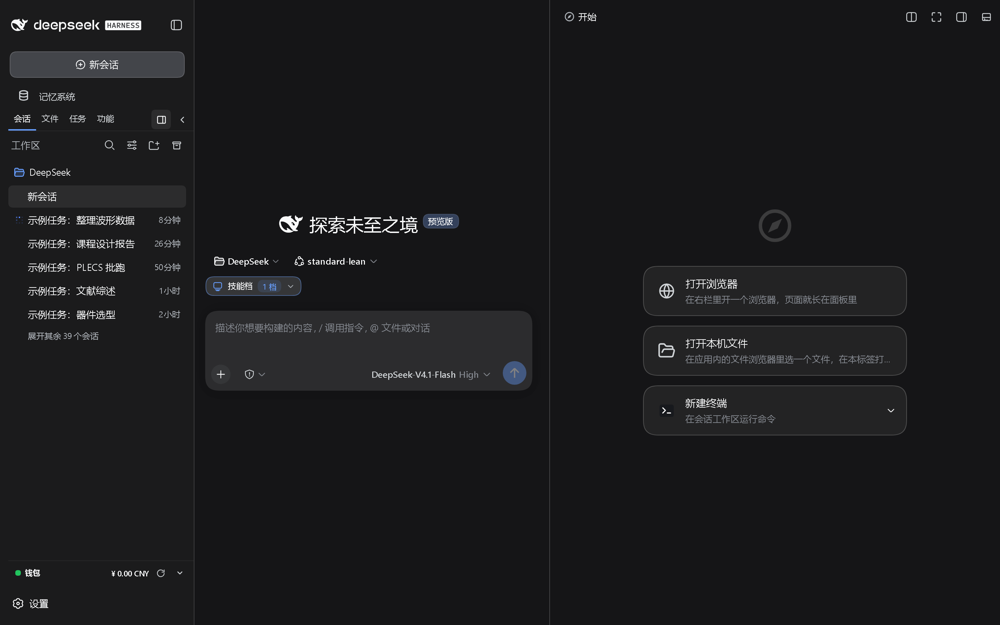
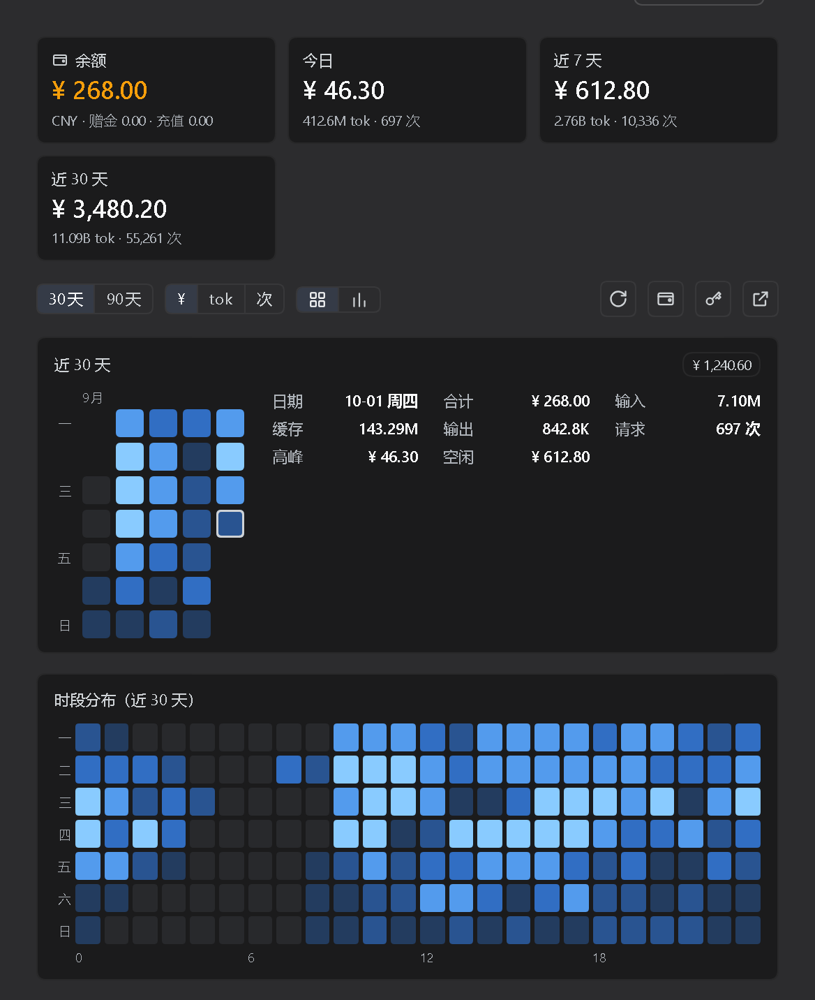

# dsh-vk-suite

中文 | [English](README.en.md)

三栏布局骨架 + 设置中心：槽位契约、布局外壳、设置分区与设置页导航。其余各家族都装在它上面

## 包

| 目录 | 作用 |
|---|---|
| `dsh-vk-contract` | 槽位契约：槽位表、栏目注册表与中立服务名 |
| `dsh-vk-layout` | 布局骨架：左栏与右栏 Tab 宿主、设置宿主、浮层座位 |
| `dsh-vk-settings` | 骨架自带的设置分区：Skill 管理、MCP 管理 |
| `dsh-vk-settings-hub` | 设置中心：自绘左栏接管官方设置面板，含插件市场与启停管理两个 tab、ZIP 归档页 |
| `dsh-usage-board` | 契约预留设置位里的用量看板：方格热力图、时段分布、峰谷占比、会话消耗排行 |
| `dsh-motion` | 三栏骨架轨道常驻过渡 + 设置页入场退场，纯 CSS 注入 |

## 版本线

| 版本 | 对应 DSH | 说明 |
|---|---|---|
| `v0.1.3` | 0.1.7 | 本次同步：右栏两轴分格、骨架与左右栏的这批改动 |
| `v0.1.2` | 0.1.7 | 0.1.7 线的上一版 |
| `v0.1.0` | 0.1.6 | 0.1.6 线的最后一版，保留可用、不再更新 |

## 装

```sh
# 只装其中一个包
dsh plugin --profile web add file:<本仓库>/dsh-vk-contract
```

整族一次装完（Windows PowerShell）：

```powershell
./install.ps1
```

不克隆仓库、直接从 Release 装（一行一个包）：

```sh
dsh plugin --profile web add "https://github.com/Ln1m/dsh-vk-suite/releases/download/v0.1.3/dsh-vk-contract-0.1.3.tgz"
dsh plugin --profile web add "https://github.com/Ln1m/dsh-vk-suite/releases/download/v0.1.3/dsh-vk-layout-0.1.5.tgz"
dsh plugin --profile web add "https://github.com/Ln1m/dsh-vk-suite/releases/download/v0.1.3/dsh-vk-settings-0.1.2.tgz"
dsh plugin --profile web add "https://github.com/Ln1m/dsh-vk-suite/releases/download/v0.1.3/dsh-vk-settings-hub-0.1.2.tgz"
dsh plugin --profile web add "https://github.com/Ln1m/dsh-vk-suite/releases/download/v0.1.3/dsh-usage-board-0.1.0.tgz"
dsh plugin --profile web add "https://github.com/Ln1m/dsh-vk-suite/releases/download/v0.1.3/dsh-motion-0.1.0.tgz"
```

装的时候若报 `UNABLE_TO_VERIFY_LEAF_SIGNATURE`（国内出口证书注入，Node 默认不读系统证书库），先执行 `$env:NODE_OPTIONS='--use-system-ca'` 再装。

装完重启 web 实例。

## 界面





## 许可

MIT
